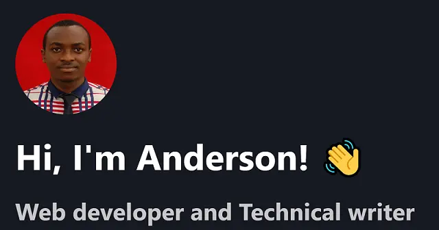

<div align="center">
  
</div>
<p align="center">
   Built with <a href="https://www.nextjs.org/" target="_blank">Next.js</a> and hosted with <a href="https://www.vercel.com/" target="_blank">Vercel</a>
</p>


## ✨ Inspiration

This project has been heavily inspired by Tamik. His GitHub repository can be found [here](https://github.com/ironsoul0/ironsoul.ninja).

## 🛠 Wanna run on your machine?

1. Clone the project

   ```sh
   git clone https://github.com/andemosa/portfolio.git
   ```

2. Install the dependencies

   ```sh
   cd portfolio
   npm i
   ```

3. Setup your Environment Variables

- change this file name .env.example to .env
- open .env and populate the file with the required keys from [Emailjs](https://www.emailjs.com/)

4. Start the development server

   ```sh
   npm run dev
   ```

## 🚁 Contributing

Feel free to contribute and suggest any improvements.
